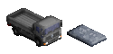
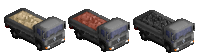
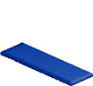
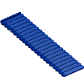
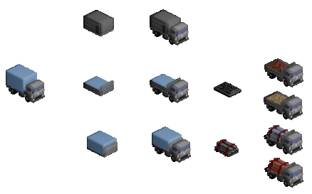

# Cargopositor

Cargopositor is a tool that takes these MagicaVoxel files:



And produces these as output:



If you create sprites using [GoRender](https://github.com/mattkimber/gorender)
then it will be obvious why this is useful. Cargopositor saves the need to
draw and edit multiple vehicle objects for different cargo graphics, making
it easier and quicker to create sprites and update them.

## Usage

Cargopositor operates on **batches** - JSON files telling it what objects
to load and what operations to perform on them. A typical batch might look
like this:

```json
{
  "files": [
    "example_input.vox"
  ],
  "operations": [
    {
      "type":  "produce_empty"
    }
  ]
}
```

Batches have the following elements:

* `files` - the MagicaVoxel files used as input objects.
* `operations` - the list of operations to perform. Each operation has a mandatory `type` and may also have its own additional fields.

### Input Files

Input .vox files are standard MagicaVoxel objects, with colour **255** used
to indicate areas which can be replaced with the various cargo elements.

### Operations

The following operations are supported:

#### identity

Does nothing to the object. However, this can be used with the `layers` parameter
to only load certain layers from the input object, which will then result in all
other layers being removed from the output. This is useful for, e.g. storing all
frames of an animation in the same voxel file and using CargoPositor to split them
for rendering.

#### produce_empty

Remove all Cargopositor-specific behaviour voxels from the object. This is
useful for producing the "base" object, so you do not need two files for
"with cargo" and "without cargo" models.

Supports recolouring.

#### scale

Scales the input across the cargo area. This is most useful for bulk cargo
and other cargoes which do not suffer adversely from being stretched in
dimensions.

Sometimes it may not be desirable to scale the object in all dimensions
across the available area, so this can be reduced by adding a `scale`
directive to the operation:

```json
"scale": {
    "x": 0.0,
    "y": 0.5,
    "z": 1.0
}
```

The value determines how much of the original source object's size to
preserve. `1.0` means to preserve completely the original size, and `0.0`
means to use the scaled size, with values between interpolated linearly.

If the source object is larger than the destination and a scaling value
other than `0.0` is used it will be clipped, ultimately turning scale 
into a `repeat` operation with `n = 1` that will copy objects
larger than the destination area.

Supports recolouring.

#### repeat

Repeats the input across the cargo area. This is most useful for crates,
metal coils and other cargo which is in discrete units. Note that the
cargo must be no larger than the destination area.

There is an additional parameter `n` which can be set to non-zero to limit
the number of repeated items.

Supports recolouring.

#### stairstep

Increases `m` steps in z (vertical) dimension for every `n` steps in x (horizontal).
Stairstep takes an input like this:



And produces an output like this:



There are two parameters for this operation:

* `x_steps`: The number of steps to take in `x` before moving up the staircase. This can be a floating point value
             for expressing gradients more precisely.
* `z_steps`: The number of steps to take in `z` at each step up

#### rotate

Rotates the source object by a given number of degrees, repeating and tiling it in the output.

There are four parameters:

* `angle`: The angle (in degrees) to rotate by.
* `x_offset`: Amount to offset the result in the x dimension.
* `y_offset`: Amount to offset the result in the y dimension.
* `scale`: How much to scale the object in x and y dimensions. This is a **reduction**, so a scale of `2.0` will result in output half the size of the input.
* `bounding_volume`: The bounding volume of the input object

Scale is specified as follows, and is optional (defaulting to 1.0 in all dimensions):

```json
"scale": {
    "x": 1.0,
    "y": 0.5
}
```

Sometimes objects "overhang" at either end and produce undesirable tiling behaviour. To resolve this,
using the `bounding_volume` setting:

```json
"bounding_volume": {
  "min": {
    "x": 2,
    "y": 2,
    "z": 0
  },
  "max": {
    "x": 64,
    "y": 64,
    "z": 0
  }  
}
```

#### rotate_y

Rotates the given source object around the Y axis by the given number of
degrees. This is useful for producing "hill" or "slope" sprites.

#### remove

Removes any filled voxels in the input from the source object. Note that
this is done for *all* voxels, not just mask voxels.

The input will not be scaled - if it is smaller or larger than the source 
object, voxels will be removed starting from the (0,0,0) co-ordinate of both
objects until the boundaries of the smaller are reached.

Mask voxels will be preserved in this operation if they are not part
of the object to be subtracted. If they are not wanted, perform a
`produce_empty` on the result.

#### clip

Clip is similar to remove, but instead *keeps* voxels where the input's voxels
are the mask colour (255).

As with `remove` the input will not be scaled - if it is smaller or larger than 
the source object, voxels will be removed starting from the (0,0,0) co-ordinate 
of both objects until the boundaries of the smaller are reached.

Mask voxels will be preserved in this operation, if they are part
of the object to be subtracted. If they are not wanted, perform a
`produce_empty` on the result.

#### Ignore Mask

Sometimes you just want to combine two objects without using a mask.
If this is the case, add the following property to the operation:

```json
"ignore_mask": true
```

Objects will be copied starting at 0,0. Only empty voxels will be overwritten -
therefore changing the order in which operations are applied (source and destination)
will produce different results.

#### Overwrite

You can force the input object to overwrite non-empty voxels in the source object
by setting `overwrite` to `true`.

#### Truncate

When using repeat with `n` of 0, you can allow truncation at edges by setting `"truncate": true`
in the operation. This is useful when using repeat to generate textures.

#### Mask Original

When using repeat, you can set all voxels of the original object that are *not* part of the
clip area to 255 by setting `mask_original` to `true`. This is useful for generating
overlay sprites with GoRender, by rendering just the pixels which should be overlaid.

#### Mask New

Similar to `mask_original`, but this will instead set all voxels of the *new* object to 255.
This is useful when you want to overlay things to allow rendering sprites occluded by other
objects.

#### Flip X Axis

When using repeat, you can set `flip_x` to `true`, and the object will be composited flipped
in X. This is useful when compositing objects which are intended to be overlaid with the
rear of another object.

#### Recolouring

Recolouring is not an operation in itself but is supported by some of
the other operations. It allows you to reassign a ramp of colours from
the input to a new ramp for the output, e.g. to re-colour a pile of
grain to a pile of copper ore.

Ramps do not have to be the same length, they can be interpolated.

To set up recolouring, add the following lines to the operation:

```json
"input_ramp": "3-12,14-15",
"output_ramp": "72-79,81-85"
```

(Note the syntax has changed since older versions of Cargopositor, old-style
files will be translated where possible)

Colour indexes in each input ramp will be linearly interpolated to the output
ramp when these are present.

When repeating multiple objects, you can also supply an array using `input_ramps`
and `output_ramps`. Both must be the same length or the parameter will be ignored.
Arrays take precedence over single values.

Example of array format:

```json
"input_ramps": ["3-12", "52-53"],
"output_ramps": ["72-79", "57-58"]
```

### Examples

An example JSON file with several operations configured can be found in
the `samples` directory.

### Tips and Tricks

Although any voxels with colour 255 will be cleared from the main voxel
object when compositing, if they are present in the **cargo** they will
be kept.

This allows for the creation of multi-pass setups, where a vehicle chassis
is first composited with various bodies, and each body is then
composited with the appropriate cargo.



In the above example, a large number of different vehicles could potentially
be produced by changing only the leftmost "base" truck object.